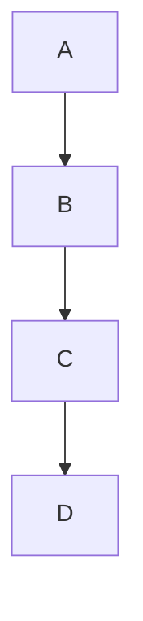

# RealtimeMD — Real-time Markdown Editor

A free, browser-based Markdown editor with live preview, virtual file management, and session persistence. No backend required.

## Features

- **Live Preview** — Renders Markdown as you type
- **Virtual Workspace** — Manage files & folders in-browser (IndexedDB)
- **Image Support** — Upload & render images with relative path resolution
- **Theme Toggle** — Dark / Light mode (persisted in localStorage)
- **Language Switcher** — English, 日本語, 中文, हिन्दी, Español, Indonesia, Português, Français, Tiếng Việt
- **Export as ZIP** — Download entire workspace as a zip archive
- **Save as PDF** — Print preview via browser print dialog (desktop and mobile)
- **Session Persistence** — Data survives browser close
- **Reset Session** — Clear session data and start fresh
- **SuperReset** — Nuclear wipe of all local data (files, caches, storage, cookies)
- **GitHub-like Markdown** — HTML blocks, MathJax, Mermaid diagrams
- **Mobile-friendly** — Bottom action bar on small screens

## Getting Started

```bash
# Serve locally
python3 -m http.server 8080
# or
npx serve .
```

Open `http://localhost:8080` in your browser.

## Images

### Supported Formats

`png`, `jpg`, `jpeg`, `gif`, `webp`, `svg`

### Relative Path Rules

Image paths in Markdown are resolved relative to the active `.md` file's directory:

```markdown


```

### Context Menu Actions

Right-click a file in the explorer:

| Action | Description |
| --- | --- |
| **Copy Relative Path** | Copies relative path from active MD file |
| **Copy as Markdown Image** | Copies `` (image files only) |

## Mobile Action Bar

On screens ≤767px, the ribbon is hidden and a compact bottom action bar appears with:
- **Theme toggle** — Switch dark/light mode
- **PDF** — Save preview as PDF
- **ZIP** — Export workspace as ZIP
- **Reset** — Reset session
- **SuperReset** — Nuclear wipe (circle-X icon)
- **Language selector** — EN/JA/ZH/HI/ES/ID/PT/FR/VI dropdown

The bar includes `env(safe-area-inset-bottom)` padding for iOS devices. The workspace content area has bottom padding to prevent the bar from covering content. Desktop/tablet layouts are unaffected.

## Reset Session

Click the reset button (↺ icon with exclamation) in the ribbon (desktop) or mobile action bar.

**Confirmation dialog** appears:
- Title: "Reset session?"
- Message explains what will be cleared
- Buttons: "Cancel" / "Reset"

**What is cleared:**
- Session data in localStorage (`realtimemd-session` key)
- All files in IndexedDB (virtual filesystem)

**What is preserved:**
- Theme preference (`realtimemd-theme`)
- Language preference (`realtimemd-lang`)

After reset, the page reloads and returns to the initial empty state with default content.

## SuperReset (Nuclear Wipe)

Click the SuperReset button (⊗ circle-X icon) in the ribbon or mobile action bar.

**Confirmation dialog** appears:
- Title: "SuperReset?"
- Message: "This will erase all local data for this app..."
- Buttons: "Cancel" / "Erase & Reload"

**What is cleared:**
- All `localStorage` entries (including theme and language)
- All `sessionStorage` entries
- All IndexedDB databases (enumerated via `indexedDB.databases()` when available, plus known app DB)
- All Cache Storage entries (Service Worker caches)
- All Service Worker registrations (if any)
- All accessible cookies for this origin (best-effort)

**Known limitations:**
- `HttpOnly` cookies cannot be cleared from JavaScript
- iOS Safari may retain some internal caches until storage pressure triggers eviction
- Cross-tab state is not guaranteed to clear if other tabs have open DB connections (handles `onblocked`)
- Browser back-forward cache (bfcache) may preserve state; `location.replace()` is used to mitigate

## HTML in Markdown

The preview supports inline HTML blocks similar to GitHub Markdown. HTML is passed through the parser and sanitized with [DOMPurify](https://github.com/cure53/DOMPurify).

### Allowed Tags

Block: `div`, `section`, `article`, `details`, `summary`, `figure`, `table`, `blockquote`, `pre`, etc.
Inline: `a`, `img`, `em`, `strong`, `kbd`, `mark`, `sub`, `sup`, `abbr`, `del`, `ins`, etc.
Media: `video`, `audio`, `source`, `picture`
SVG: Full subset for Mermaid diagram rendering

### Blocked Elements

- `<script>` — completely removed
- `<iframe>` — completely removed
- `<object>`, `<embed>` — completely removed
- `<style>` — completely removed
- `<form>` — completely removed
- All inline event handlers (`onclick`, `onerror`, `onload`, etc.) — stripped

### Example

```markdown
This is <mark>highlighted</mark> and this is <kbd>Ctrl+C</kbd>.

<details>
<summary>Click to expand</summary>
Hidden content here.
</details>
```

## MathJax

Math expressions are rendered using [MathJax 3](https://www.mathjax.org/) (loaded from CDN).

### Supported Delimiters

| Delimiter | Type | Example |
| --- | --- | --- |
| `\( ... \)` | Inline math | `\( E = mc^2 \)` |
| `\[ ... \]` | Display math | `\[ \int_0^\infty e^{-x} dx = 1 \]` |

**Note:** `$ ... $` delimiters are NOT supported to avoid conflicts with the Markdown parser.

MathJax typesetting is debounced (150ms) to avoid lag during rapid typing.

## Mermaid Diagrams

[Mermaid](https://mermaid.js.org/) diagrams render from fenced code blocks (loaded from CDN).

### Usage

````markdown

````

### Features

- Diagrams auto-render in the preview pane
- Theme-aware: switches between light/dark Mermaid themes with the app theme
- Rendering is debounced (200ms) and cached — unchanged diagrams are not re-rendered
- Security level set to `strict`

### Limitations

- Requires internet access to load CDN libraries on first use
- Very complex diagrams may cause rendering delays
- Parse errors are shown inline as red error messages

## Theme Toggle

- Click the sun/moon icon in the ribbon to toggle Dark / Light mode
- Theme is persisted in `localStorage` (`realtimemd-theme`)
- Default theme: **Dark**
- Mermaid diagrams re-render with matching theme on toggle

## Language Switcher

Nine languages: **English** (default), **Japanese**, **Chinese (Simplified)**, **Hindi**, **Spanish**, **Indonesian**, **Portuguese**, **French**, **Vietnamese**

- Select from ribbon (desktop) or bottom bar (mobile)
- All UI labels, tooltips, context menus, and toasts are translated
- Persisted in `localStorage` (`realtimemd-lang`)

## Export Workspace as ZIP

- Click ZIP button in ribbon or mobile action bar
- Downloads `realtimeMD-workspace-YYYYMMDD.zip`
- Uses [JSZip](https://stuk.github.io/jszip/) from CDN

## Save Preview as PDF

- Click PDF button in ribbon or mobile action bar
- Opens a new browser window with clean preview HTML and triggers the print dialog
- Print stylesheet renders only the preview content with proper pagination
- MathJax output is included (loaded in the print window if math is detected)
- Multi-page printing works automatically (⁠`height: auto`, `overflow: visible`)
- On mobile, a hint toast appears: "Use the print dialog to save as PDF."
- No client-side PDF generation libraries are required

## Keyboard Shortcuts

| Shortcut | Action |
| --- | --- |
| `Ctrl+B` | Bold |
| `Ctrl+I` | Italic |
| `Ctrl+K` | Insert Link |
| `Ctrl+S` | Save |
| `Ctrl+Z` | Undo |
| `Ctrl+Shift+Z` / `Ctrl+Y` | Redo |
| `Ctrl+F` | Find |
| `Ctrl+H` | Find & Replace |
| `Escape` | Close Find bar |

> **Find/Replace** supports Match Case, Whole Word, and Regex toggles. Use Enter / Shift+Enter to navigate next/prev match. Match count displays "3 of 17" style.

## Browser/Performance Limitations

- CDN scripts (DOMPurify, MathJax, Mermaid, JSZip) require internet on first load
- Large MathJax expressions or complex Mermaid diagrams may cause brief rendering delays
- PDF output quality depends on the browser's print engine (best in Chrome/Edge)
- Images must be uploaded to the virtual workspace (IndexedDB)
- Browser sandboxing prevents reading local disk files
- iOS Safari has unique storage behaviors; see SuperReset section

## License

See [LICENSE](LICENSE).
